```{r setup, include=FALSE}
library(knitr)
knitr::opts_chunk$set(echo = TRUE)
```

## Introduction to ordinal logistic regression

Ordinal logistic regression is applied when the dependent variable is measured at the ordinal level, given one or more independent variables, which could be ordinal, continuous and categorical. Usually, there are two assumptions that needs to be checked for the ordinal logistic regression, no multicollinearity and existence of proportional odds. By no multicollinearity assumption, the variables are not highly correlated with each other; the proportional odds mean that the independent variables have identical effects at each dependent variable levels.

## Description of the Data

In this tutorial, we will use the "**soup**" data from the R package "**Ordinal**". The dataset represents the ratings of sample soup from 185 respondents, including '**sureness**' which is the respondents ratings of soup samples, and other descriptive variables, such as '**souptype**', '**cold**' and '**soupfreq**' ('**souptype**', with three types canned, dry-mix and self-made; **cold**', which is a Yes/No variable where Yes indicates that respondent have a cold; '**soupfreq**' with 3 levels, which is the frequency with which the respondent consumes soup). By fitting ordinal logistic regression model to the data, we desire to determine the factors that will significantly influence the soup rating, and also explore the marginal effects of the factors of interest.  We will display the data manipulation and analysis in three different languages, R, STATA and SAS. A link to the data descripition could be found [here](https://cran.r-project.org/web/packages/ordinal/ordinal.pdf).

## Implementation

##{.tabset .tabset-fade}

### Ordinal Logistic Regression in SAS


Similar in R and STATA, the first step is to import the data into the workspace. 

```{r, echo = TRUE, message=FALSE, warning=FALSE, eval=FALSE}
proc import datafile='/folders/myfolders/soup.csv'
out=work.soup
dbms=CSV;
run;
```

To view first ten rows of data. 

```{r, echo = TRUE, message=FALSE, warning=FALSE, eval=FALSE}
proc print data=soup (obs=10);
run;
```

```{r, echo = FALSE, message=FALSE, warning=FALSE}
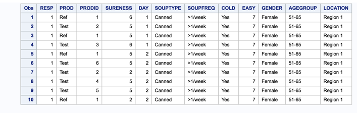
```

As we planned to fit the model based on the dependent variable 'sureness', it would be desired to explore the frequency and means of the variable 'sureness'.

```{r, echo = TRUE, message=FALSE, warning=FALSE, eval=FALSE}
proc freq data=soup;
tables SURENESS;
run;

proc means data=soup;
var SURENESS;
run;
```

```{r, echo = FALSE, message=FALSE, warning=FALSE}
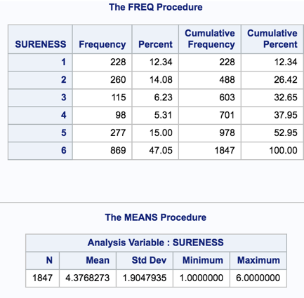
```

From the table above, it's clear that 'sureness' has higher proportion in higher end, 5 or 6, which will results in a high mean value as 4.3768.

Next, we pick the factors of interest and check whether they will have potential effects on the dependent variable 'sureness'. 

```{r, echo = TRUE, message=FALSE, warning=FALSE, eval=FALSE}
proc freq data=soup;
tables SURENESS*SOUPTYPE / norow nocol missprint;
tables SURENESS*SOUPFREQ / norow nocol missprint;
tables SURENESS*COLD / norow nocol missprint;
run;
```

```{r, echo = FALSE, message=FALSE, warning=FALSE}
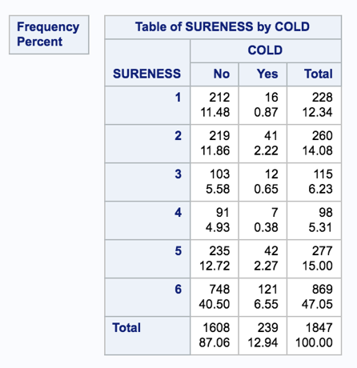
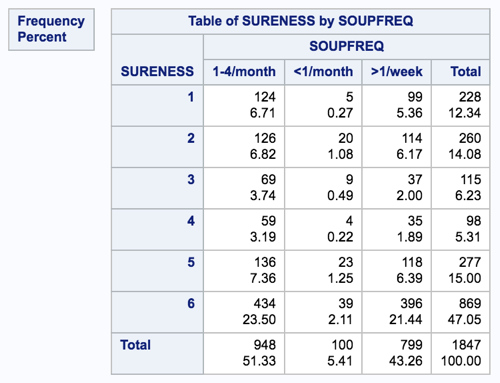
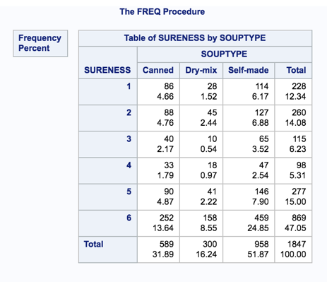
```

The tables above suggests that the binary variable 'cold' and categorical variable 'souptype' cause some difference in 'sureness, while 'soupfreq' does not show effects on 'sureness'. Therefore, a model '**sureness ~ souptype + cold**' is fitted to the data. 

```{r, echo = TRUE, message=FALSE, warning=FALSE, eval=FALSE}
proc logistic data=soup desc;
class SOUPTYPE(ref='Self-made') COLD(ref='No') / param=reference;
model SURENESS= SOUPTYPE COLD ;
estimate "Pr prob SURENESS=2 at SOUPTYPE='Canned' " intercept 1  SOUPTYPE 1 COLD 1/ ilink category='2';
estimate "Pr prob SURENESS=2 at SOUPTYPE='Dry-mix' " intercept 1 SOUPTYPE 2 COLD 1/ ilink category='2';

run;
```

```{r, echo = FALSE, message=FALSE, warning=FALSE}
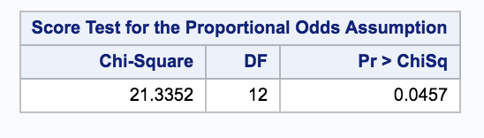
```

From the test above, because the p-value is smaller than 0.05, the null hypothesis can be rejected and the proportional odds assumption is valid for the model.

```{r, echo = FALSE, message=FALSE, warning=FALSE}
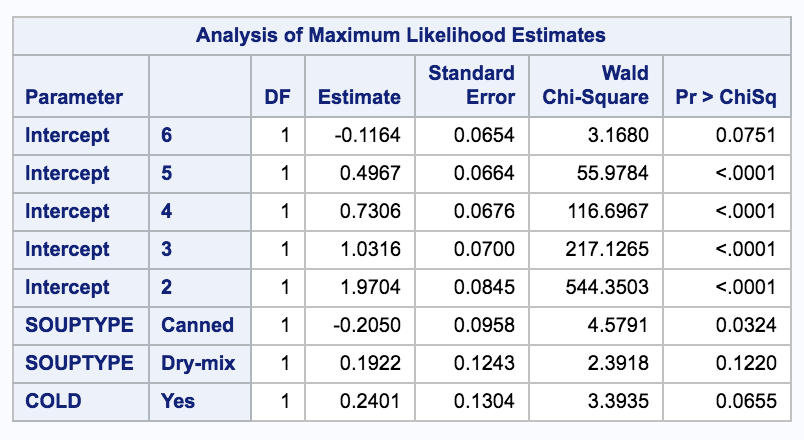
```

From the table above, the 'souptype' has p-value smaller than 0.05 while 'cold' does not, which indicates that only 'souptype' is a significant variable in explaining the variance. In terms of the coefficients, for example, when 'souptype' changes from 'self-made' to 'canned', the sureness will decrease by 0.2050, given that all of the other variables in the model are held constant. 

```{r, echo = FALSE, message=FALSE, warning=FALSE}
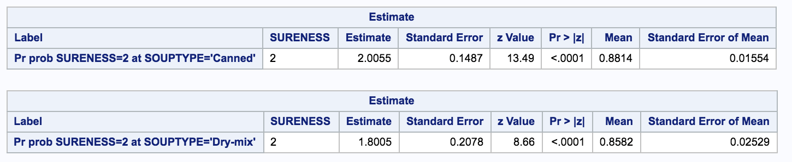
```

Then table above shows that for sureness =2, the predicted probability for 'dry-mix' and 'canned' soup are 0.8582 and 0.8814 correspondingly. These numbers are different from those in R and STATA, because the order of variable 'sureness' is different, as indicated by the opposite sign of intercepts in SAS from those in R and STATA. 


### Ordinal Logistic Regression in R

```{r, echo = FALSE, message=FALSE, warning=FALSE}
library(MASS)
library(data.table)
library(ordinal)
library(Hmisc)
```

The first step is to import the data into the workspace. 

```{r, echo = TRUE, message=FALSE, warning=FALSE}
data(soup)
soup_test = data.table(soup)
```

Next we looked at the first ten rows of the data set.

```{r, echo = TRUE, message=FALSE, warning=FALSE}
soup_test[1:10,]
```

This data set has a six level variable called "sureness", which is the respondents ratings of soup samples, that we will use as our outcome variable. It would be desired to explore the frequency and mean of it.

```{r, echo = TRUE, message=FALSE, warning=FALSE}
summary(soup_test$SURENESS)
mean(as.numeric(soup_test$SURENESS))
```

From the output, it's clear that 'sureness' has higher proportion in higher end, 5 or 6, which will results in a high mean value as 4.3768.

Then, we pick some factors of interest and check whether they will have potential effects on the dependent variable 'sureness'. Let's start with the descriptive statistics of these variables "souptype", "cold" and "soupfreq".

```{r, echo = TRUE, message=FALSE, warning=FALSE}
lapply(soup_test[,c("SOUPTYPE", "SOUPFREQ", "COLD", "SURENESS")], table)
ftable(xtabs(~ SOUPTYPE + SOUPFREQ + COLD + SURENESS, data = soup_test))
```

The tables above shows that there are some rows are all 0 because of the "soupfreq", so we could not use "soupfreq" as predictor. Therefore, a model '**sureness ~ souptype + cold**' is fitted to the data.

Below we use the polr command from the MASS package to estimate an ordered logistic regression model. 

```{r, echo = TRUE, message=FALSE, warning=FALSE}
m = polr(SURENESS ~ SOUPTYPE + COLD, data = soup_test, Hess = TRUE)
summary(m)
```

Next, we test the proportional odds assumption:

```{r, echo = TRUE, message=FALSE, warning=FALSE}
sf = function(y) {
  c('Y>=1' = qlogis(mean(y >= 1)),
    'Y>=2' = qlogis(mean(y >= 2)),
    'Y>=3' = qlogis(mean(y >= 3)),
    'Y>=4' = qlogis(mean(y >= 4)),
    'Y>=5' = qlogis(mean(y >= 5)),
    'Y>=6' = qlogis(mean(y >= 6)))
}

s = with(soup_test, 
          summary(as.numeric(SURENESS) ~ SOUPTYPE + COLD, fun = sf))
s
```

We can use the values in this table to help us assess whether the proportional odds assumption is reasonable for our model. The difference between each set of categories of the dependent variable remains similar. So the proportional odds assumption is valid for the model.

To add p-values, first we store the coefficient table, then calculate the pvalues and combine back with the table.

```{r, echo = TRUE, message=FALSE, warning=FALSE}
ctable = coef(summary(m))
p = pnorm(abs(ctable[, "t value"]), lower.tail = FALSE) * 2
(ctable = cbind(ctable, "p value" = p))
```

We can also get confidence intervals for the parameter estimates. If the 95% CI does not cross 0, the parameter estimate is statistically significant.

```{r, echo = TRUE, message=FALSE, warning=FALSE}
(ci = confint(m))
```

From the table above, the CIs of 'souptype' canned do not include 0 while the CIs of 'cold' does, which indicates that only 'souptype' is a significant variable in explaining the variance. 

To get the odd ratios and confidence intervals, we just exponentiate the estimates and confidence intervals.

```{r, echo = TRUE, message=FALSE, warning=FALSE}
exp(coef(m))
exp(cbind(OR = coef(m), ci))
```

These coefficients are called proportional odds ratios and we would interpret these pretty much as we would odds ratios from a binary logistic regression. For cold, we would say that for a one unit increase in cold, the odds of sureness 1  versus sureness higher rate combined are 1.27 greater, given that all of the other variables in the model are held constant.

Last, we can obtain predicted probabilities, which are usually easier to understand than either the coefficients or the odds ratios.

```{r, echo = TRUE, message=FALSE, warning=FALSE}
newdat = data.frame(SOUPTYPE = soup_test$SOUPTYPE,
                    COLD = soup_test$COLD)
newdat_p = cbind(newdat, predict(m, newdat, type = "probs"))
deduped.data = unique(newdat_p[, 1:8])
deduped.data
```

Then table above shows that for sureness = 2 and cold = Yes, the predicted probability for 'dry-mix' and 'canned' soup are 0.1049 and 0.1374 correspondingly. The results are same with the results from Stata. 


### Ordinal Logistic Regression in Stata

The first part of the code was to read in the data:

```{r, echo = TRUE, message=FALSE, warning=FALSE, eval=FALSE}
import delimited "soup_data.csv"
```

Next we looked at the first ten rows to get an idea of the data set

```{r, echo = TRUE, message=FALSE, warning=FALSE, eval=FALSE}
list if v1 <=10
```

```{r, echo = FALSE, message=FALSE, warning=FALSE}
include_graphics("stata2g.png")
```

The next step was to look at the variable sureness as we were using this variable as the response variable. We created some frequency and contingency tables for the variable with possible predictor variables:

```{r, echo = TRUE, message=FALSE, warning=FALSE, eval=FALSE}
tab sureness
tabstat sureness, s(n mean SD)
```

```{r, echo = FALSE, message=FALSE, warning=FALSE}
include_graphics("stata3g.png")
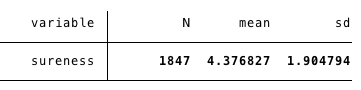
```

From the table above, having a mean of 4.377, shows that there is a higher proportion of values on the higher end of the sureness scale. 

```{r, echo = TRUE, message=FALSE, warning=FALSE, eval=FALSE}
tab sureness souptype2
```

```{r, echo = FALSE, message=FALSE, warning=FALSE}
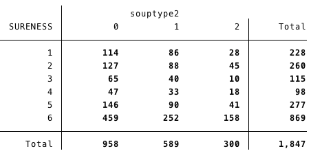
```

```{r, echo = TRUE, message=FALSE, warning=FALSE, eval=FALSE}
tab sureness cold2
```

```{r, echo = FALSE, message=FALSE, warning=FALSE}
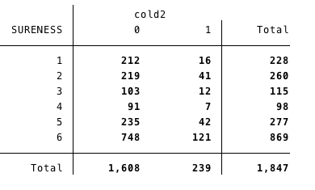
```

The predictor variables we chose were souptype and cold so the model was fit as:
**sureness ~ souptype + cold**.

Souptype and cold were recoded as numbers so they would be easier to use as factors. 

```{r, echo = TRUE, message=FALSE, warning=FALSE, eval=FALSE}
gen cold2 = 1 if cold == "Yes"
replace cold2 = 0 if cold == "No"

gen souptype2 = 0 if souptype == "Self-made"
replace souptype2 = 1 if souptype == "Canned"
replace souptype2 = 2 if souptype == "Dry-mix"
```

The summary for the model is shown below:

```{r, echo = TRUE, message=FALSE, warning=FALSE, eval=FALSE}
ologit sureness i.souptype2 i.cold2
```

```{r, echo = FALSE, message=FALSE, warning=FALSE}
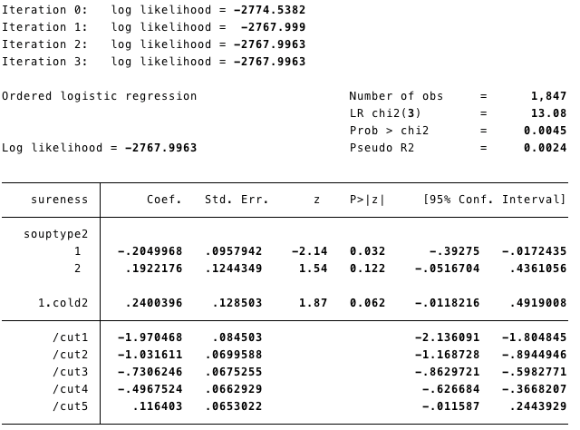
```

Looking at the chi-squared test since p-value is equal to .0045, which is less than .05, we can reject the null hypothesis that no relationship exists. 

Below is a prediction for the percent for sureness equal to two and souptype equal to canned and dry-mix and the soup being cold, as well as a graph with a 95% confidence interval for the prediction of sureness given the souptype and cold. 

```{r, echo = TRUE, message=FALSE, warning=FALSE, eval=FALSE}
margins souptype2 cold2
margins, at(souptype2 = (1/2) cold2 = 1) predict(outcome(2)) 
marginsplot, recast(line) recastci(rarea) xtitle("Soup Type") ytitle("Prob.")
```

```{r, echo = FALSE, message=FALSE, warning=FALSE}
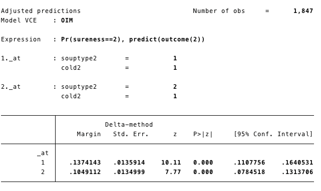
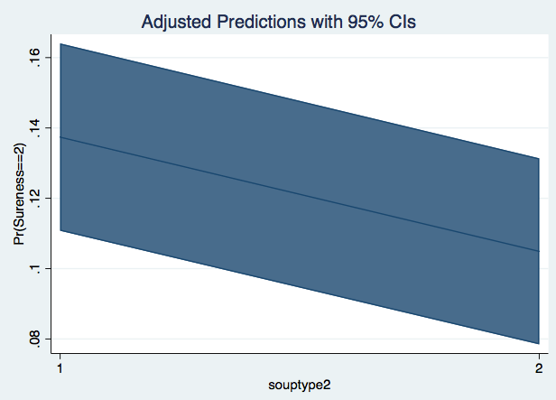
```

The plot shows the difference in probabilities, between canned and dry-mix, of sureness equal to two, when the respondent has a cold. When the souptype is canned the probability of sureness being equal to two is .105 and when souptype is dry-mix the probability of sureness being equal to two is .137. 

## Summary

The results of the model showed that a change from self-made to canned soup would have a negative effect on sureness, where as changing from self-made to a dry-mix would have a positive effect. Also, the respondent having a cold would also have a positive effect when compared to a respondent who does not have a cold. 

Ordinal logistic regression is used when there are more than two ordered response categories. After obtaining a model, we can also obtain predicted probabilities at given values, which was shown at the end of each tutorial. These probabilities are usually easier to understand and interpret than what is given in the model. 


## References
[UCLA Institute for Digital Research and Education - Ordinal Logistic Regression](https://stats.idre.ucla.edu/other/dae/)   
[Statistics.laerd.com. (2018). How to perform an Ordinal Regression in SPSS | Laerd Statistics.](https://statistics.laerd.com/spss-tutorials/ordinal-regression-using-spss-statistics.php)
